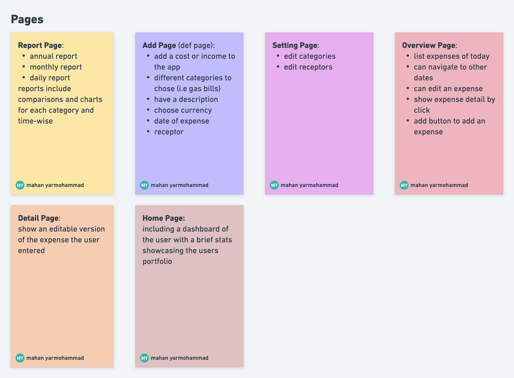

# Countcent

Count every cent you expend 💸.

This project is an expense tracker so that you can keep track of every Cent you spend.

## List of features 🤩:

* 🗂️ Create your own categories (and assign an emoji to it so it could be easy to track)
* ⚡️ Enter the expense in an instant. It should be fast, or else you would not do it 😉.
* 📊 See a report of your daily, monthly, and annual expenses with a chart
* 🌗 easily toggle between dark and light mode

App's pages overview:

